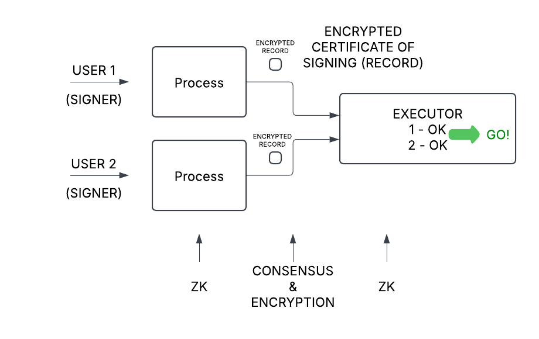

# truZt arKanum (Trust Arcanum - Secret Trust) - Secretly Programmable Money

The demo instructions and video can be found [here](./demo/README.md).

## Abstract

truZt arKanum is a Secretly Programmable money protocol. It allows for private fund transfers with plausible deniability,
executable at a pre-determined time in the future, controlled by multiple signers and pre-programmed on-chain conditions.
It also allows the participants to reveal their transactions if they want to, in order to cater to defense against accusations of wrongdoing or breach of agreement.

## Introduction

Generally blockchains protect against data corruptibility via consensus. This naturally entails visibility of all data. Yet,
data privacy is important, especially when it involves finances. Needless to discuss the reason for banking secrecy.

Notable pioneering project in on-chain fund transfer privacy is Tornado.cash. It has allowed shielding of the source and destination
of fund transfers. This is a good start, however a lot more functionality is needed:
- Plausible deniability: It is not enough to shield the connection between the sender and the recipient of the funds. They need to be
protected from prying eyes that they participated in such transfers at all.
- Timing: Future private transactions need protection as well. This is important for inheritance processing.
- Multiple signers: Private transactions that need approval of multiple participants. This is important in will executor cases, corporate financial
controls and many other cases.
- Conditions: Private transactions that need satisfaction of certain future on-chain conditions before execution. This is important in grant disbursement, investment management and other cases.
- Revealing: If accused of wrongdoing, the participants in such private transactions should be able to selectively reveal their actions in order to defend themselves by giving read-only access to the authorities or other accusers
of unethical behavior.

The truZt arKanum protocol provides a solution to the above issues in a simple manner using combination of Zero Knowledge and Consensus mechanisms.

## Implementation

We have chosen the ***Aleo*** blockchain for the implementation of the truZt arKanum Protocol. The reasons for this
are the following features of Aleo:
- Zero Knowledge proving system that allows off-chain execution and proof of correctness of such actions.
- Encrypted records that allow transfer of private information between participants.
- Built-in nullifier handling which avoids unnecessary duplicate code.
- Consensus which allows for participation of multiple parties.
- Programmability which allows expressing execution conditions of the financial transactions.
- View Keys which allow for read-only revelation of transactions, to to clear honest participants' names. 

### Secret transfers with plausible deniability

For anyone to dive into secrecy, they first have to perform a public-to-private transfer into the protocol used. 
Aleo Token Registry allows for public-to-private transfers, and the amounts of the transfers are private. The private
recipient is not visible either. However, anyone can see that the originator sent public tokens to be hidden.
In Tornado.cash both participants are visible (but not connected to each other), and that is how they got discovered and
sanctioned. What we need is ***plausible deniability***. We borrowed the idea from [EIP-7503](https://eip7503.org), but unlike it
our implementation is extremely simple as there is no need to re-implement nullifier storage in Aleo.

Simply, if no-one knows the private key of an address, we can call that a ***Dead Address***. Sending tokens to the Dead Address
is equivalent to burning those tokens. The truZt arKanum Protocol wraps any ARC-20 tokens issued by anyone. If anyone burns the wrapper
token by sending it to a dead address and proves this, truZt arKanum will privately mint the same amount of wrapper tokens and deliver
them to the sending address. Any observer will not distinguish whether the sender just moved the tokens to another address or burned them
to hide their tracks. The effect of burning and minting the wrapper tokens is net-zero, so it all works out:

Finding a dead address is relatively easy. The premise is that it is extremely difficult to find the private key $k_p$ for a given 128-bit unsigned number $n$ that derives the address address $a$ (assume the raw binary value):

$a = \operatorname{BHP::hash\_to\_group}(k_p)) = \operatorname{Pedersen128}(n)$

So, by proving that the user knows the number $n$ fed as private input to the proof that the address $a$, fed as a public input to the proof, calculated as follows:

$a = \operatorname{Pedersen128}(n)$

shows that it's extremely hard to guess the private key $k_p$ Such likehood of guessing is $\frac{1}{2^{128}}$, as the entropy of Pedersen128, the worse of the above two hashes (BHP and Pedersen128) is 128 bits. Therefore we can safely assume that $a$ is a dead address.

As opposed to thousands of lines of code to implement EIP-7503 on both client and on-chain side, our implementation needs nothing
on the client side and less than 10 lines of Leo code for the logic. ***We wish that Aleo includes this in their future version of 
Token Registry, so that even token wrapping would not be needed, and all tokens can enjoy plausible deniability on public-to-private transfers.***

### Time

All secret transfers have a vesting time parameter $t_v$. This is the earliest time at which the transfer can be executed.
To avoid revealing this time, when ready to execute, the execution call produces the latest block time $t_l$ that is earlier than the current block time $t_b$,
and send that instead of the actual vesting time. This could be any $t_l$ such that $t_l \lt t_b$, but to reveal nothing more than necessary, we always pass the latest block time.
This satisfies the on-chain visible timing condition without revealing the actual vesting time:

In Aleo we did not find a built-in way to discover the block time, so we use the block height instead.

### Multisig

To have multiple users produce ZK proofs and aggregate them off-chain would be a complex task. That would also require off-chain coordination by the Web3 application, which may not be as decentralized as we would want to. 

To solve this problem, instead of aggregating ZK proofs, we use a combination of ZK and Consensus, which is natural in Aleo. The Aleo Records contain encrypted information secured by ZK proofs and governed by Consensus. Aleo Consensus assures that the Records cannot be created or consumed by unintended actors, and they are encrypted anyway:

### General conditions

Finally the transfers can be governed by on-chain conditions (even if they are brought on-chain by oracles). These conditions can be, for example:
- I'll match your fund raise if you manage to raise $x$-amount, etc.
- We will disburse the investment once your TVL reaches $x$ and ...
Here is the illustration:

Unfortunately, the Aleo contracts are not upgradable yet, so at this time, the entire
protocol contract has to be re-deployed for each such programmed condition. Yet, this is not a problem, as this is not an expensive operation, especially if large amounts of funds are in question.

### Verification

Nothing needs to be done here. Aleo allows for creation of View Keys from any private key. Revealing the view
key allows the recipient to discover and read the transactions that have used the corresponding private key.

Each participant has to agree to disclose their actions and reveal their Vew Keys.

Using different private keys (accounts) can help users isolate their unrelated actions against being cross-referenced.

## Future work
