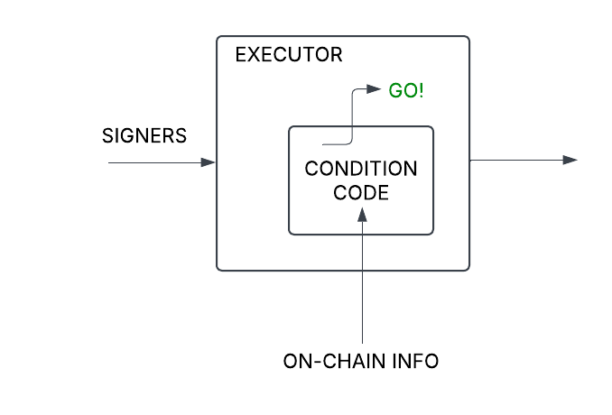

# truZt arKanum (Trust Arcanum - Secret Trust) - Secretly Programmable Money with Total Plausible Deniability

The demo instructions and video can be found [here](./demo/README.md).

## Abstract

truZt arKanum is a Secretly Programmable money protocol that
achieves maximal Plausible Deniability. It allows for indistinguishable private and public fund transfers,
executable at a pre-determined secret time in the future, controlled by multiple secret signers and pre-programmed on-chain conditions.
It also allows the participants to reveal their transactions if they want to, in order to cater to defense against accusations of wrongdoing or breach of agreement.

## Introduction

Generally blockchains protect against data corruptibility via consensus. This naturally entails visibility of all data. Yet,
data privacy is important, especially when it involves finances. Needless to discuss the reason for banking secrecy.

Notable pioneering project in on-chain fund transfer privacy is Tornado.cash. It has allowed shielding of the source and destination
of fund transfers. This is a good start, however a lot more functionality is needed:
- Plausible deniability: It is not enough to shield the connection between the sender and the recipient of the funds. They need to be
protected from prying eyes that they participated in such transfers at all.
- Timing: Future private transactions need protection as well. This is important for inheritance processing.
- Multiple signers: Private transactions that need approval of multiple participants. This is important in will executor cases, corporate financial
controls and many other cases.
- Conditions: Private transactions that need satisfaction of certain future on-chain conditions before execution. This is important in grant disbursement, investment management and other cases.
- Revealing: If accused of wrongdoing, the participants in such private transactions should be able to selectively reveal their actions in order to defend themselves by giving read-only access to the authorities or other accusers
of unethical behavior.

The truZt arKanum Protocol (read as Trust Arcanum - Secret Trust) provides a solution to the above issues in a simple manner using combination of Zero Knowledge and Consensus mechanisms.

## Implementation

We have chosen the ***Aleo*** blockchain for the implementation of the truZt arKanum Protocol. The reasons for this
are the following features of Aleo:
- Zero Knowledge proving system that allows off-chain execution and proof of correctness of such actions.
- Encrypted records that allow transfer of private information between participants.
- Built-in nullifier handling which avoids unnecessary duplicate code.
- Consensus which allows for participation of multiple parties.
- Programmability which allows expressing execution conditions of the financial transactions.
- View Keys which allow for read-only revelation of transactions, to to clear honest participants' names. 

### Secret transfers with plausible deniability

For anyone to dive into secrecy, they first have to perform a public-to-private transfer into the protocol used. 
Aleo Token Registry allows for public-to-private transfers, and the amounts of the transfers are private. The private
recipient is not visible either. However, anyone can see that the originator sent public tokens to be hidden.
In Tornado.cash both participants are visible (but not connected to each other), and that is how they got discovered and
sanctioned. What we need is ***plausible deniability***. We borrowed the idea from [EIP-7503](https://eip7503.org), but unlike it
our implementation is extremely simple as there is no need to re-implement nullifier storage in Aleo.

Simply, if no-one knows the private key of an address, we can call that a ***Dead Address***. Sending tokens to the Dead Address
is equivalent to burning those tokens. The truZt arKanum Protocol wraps any ARC-20 tokens issued by anyone. If anyone burns the wrapper
token by sending it to a dead address and proves this, truZt arKanum will privately mint the same amount of wrapper tokens and deliver
them to the sending address. Any observer will not distinguish whether the sender just moved the tokens to another address or burned them
to hide their tracks. The effect of burning and minting the wrapper tokens is net-zero, so it all works out:

Finding a dead address is relatively easy. The premise is that it is extremely difficult to find the private key $k_p$ for a given 128-bit unsigned number $n$ (nonce) that derives the address address $a$ (assume the raw binary value):

$a = \operatorname{BHP::hash\_to\_group}(k_p)) = \operatorname{Pedersen128}(n)$

So, by proving that the user knows the number (preferably randomly generated to avoid collisions, however benign they are to the protocol) $n$ fed
as private input to the proof that the address $a$, fed as a public input to the proof, calculated as follows:

$a = \operatorname{Pedersen128}(n)$

shows that it's extremely hard to guess the private key $k_p$ Such likelihood of guessing is $\frac{1}{2^{128}}$, as the entropy of Pedersen128, the weaker of the above two hashes (BHP and Pedersen128) is 128 bits. Therefore we can safely assume that $a$ is a dead address. This can be improved to 256
bit by using another hash or a sponge, but that's a discussion for another day.

As opposed to thousands of lines of code to implement EIP-7503 on both client and on-chain side, our implementation needs nothing
on the client side and less than 10 lines of Leo code for the logic. ***We wish that Aleo includes this in their future version of 
Token Registry, so that even token wrapping would not be needed, and all tokens can enjoy plausible deniability on public-to-private transfers.***

#### Public Transfers indistinguishable from Private ones -  more Plausible Deniability

To make the transaction indistinguishable from any other public transfers, we can pass the nonce $n = 0$ (as private input to the ZK proof). Our
program will perform a regular public transfer, and no one can find out about this either.

#### Secret Token Burning with Plausible Deniability

If we create a Dead Address and still pass the nonce $n = 0$ as private input, we achieve Burning of the token. This may not be useful to our cause,
but other protocols can use this to achieve ***Secret Deflation***.

### Secret Time with Plausible Deniability

All secret transfers have a vesting time parameter $t_v$. This is the earliest time at which the transfer can be executed.
To avoid revealing this time, when ready to execute, the execution call produces the latest block time $t_l$ that is earlier than the current block time $t_b$,
and send that instead of the actual vesting time. This could be any $t_l$ such that $t_l \lt t_b$, but to reveal nothing more than necessary, we always pass the latest block time.
This satisfies the on-chain visible timing condition without revealing the actual vesting time:

This way ***no one can find out the time parameter***, or ***whether there is one at all*** as we can pass a past time as requirement, effectively ignoring the
timing restriction.

In Aleo we did not find a built-in way to discover the block time, so we use the block height instead.

### Multisig with Plausible Deniability

To have multiple users produce ZK proofs and aggregate them off-chain would be a complex task. That would also require off-chain coordination by the Web3 application, which may not be as decentralized as we would want to. 

To solve this problem, instead of aggregating ZK proofs, we use a combination of ZK and Consensus, which is natural in Aleo. The Aleo Records contain encrypted information secured by ZK proofs and governed by Consensus. Aleo Consensus assures that the Records cannot be created or consumed by unintended actors, and they are encrypted anyway:

Each signer creates an incorruptible secret "voucher" that states "I signed" and proves it. Yet, ***no one can find out  who signed***, as Aleo
transactions can be broadcasted by anyone. All we know is that someone is interacting with Aleo, but since there are no async functions that record
public information, the generated Aleo Records for Vouchers and their Serial Numbers (nullifiers) are indistinguishable from any other Records.

### General conditions

Finally the transfers can be governed by on-chain conditions (even if they are brought on-chain by oracles). These conditions can be, for example:
- I'll match your fund raise if you manage to raise $x$-amount, etc.
- We will disburse the investment once your TVL reaches $x$ and ...
Here is the illustration:

Unfortunately, the Aleo contracts are not upgradable yet, so at this time, the entire
protocol contract has to be re-deployed for each such programmed condition. Yet, this is not a problem, as this is not an expensive operation, especially if large amounts of funds are in question.

### Verification

Nothing needs to be done here. Aleo allows for creation of View Keys from any private key. Revealing the view
key allows the recipient to discover and read the transactions that have used the corresponding private key.

Each participant has to agree to disclose their actions and reveal their Vew Keys.

Using different private keys (accounts) can help users isolate their unrelated actions against being cross-referenced.

## Usage instructions

We all know what part of Tornado.cash was attacked first, and shut down: the ***Web3 User Interface***. It can be hosted by immutable content-addressable mechanisms such as IPFS and pointed by ENS (Ethereum Naming Service) domains, but the most frequent front end used is one with classical Web hosting, and cached by Content Delivery Networks (CDN) for high performance.

Web User Interfaces have been prone to cyber attacks as well. No matter how secure the on-chain program is, the weakest link is the
Web front end, and if it can be hacked / modified, the users can be
victims of theft.

So, we decided to provide a Command Line Interface (CLI) that can
be found in this Source Code Repository, with signed releases, when
time comes for it. Users can clone the repo, install locally and
not worry about the web site being taken down.

All CLI utilities are documented [here](./CLI/README.md).

## Problems encountered

1. The Amareleo development node apparently does not come with `token_registry.aleo` pre-installed.
Trying to install it, we encountered an issue with identifier name length limitation of 31 in the
latest Leo compiler. To mitigate this issue, we copied the program to the folder `/token_registry_workaround`,
shortened the names, recompiled and put it in our install script to be installed. For more details
see [here](./token_registry_workaround/README.md).

2. We tried to write JavaScript versions of all our command line user interface utilities. However,
the `@provablehq/sdk` library fails to broadcast the transactions properly. The transactions are partially
broadcast and can be seen using the `leo query transaction` utility, but they return `HTTP 500` error. 
To mitigate this issue, we wrote command line utilities using the `leo execute --broadcast` command in
order to broadcast the transactions. This is documented and demonstrated in `/cli/test_mintBEAN.sh` and  `/cli/mintBEAN.js` and the equivalent fixed version is in `/bean_token/mint_BEAN.sh`.

3. We needed to use the function `BHP256::hash_to_field` in JavaScript/Node.js in our command line utilities.
As the argument packaging was not documented, we could not find a way to call this, as seen in `/cli/bal.js`.
To mitigate this issue we created an Aleo function named `balance_key` in the program `/trust/trust.leo` and
called it from our library `/cli/queryBalanceKey.js` to achieve the same, although less efficiently.

4. Currently Aleo programs have to know the addresses of the other programs they are calling, and the programs are
not upgradeable yet. This makes it difficult
to deploy various custom programmed conditions for fund transfers. However this is not a big problem - the entire
protocol can be re-deployed with the addition of each new custom programmed condition. Aleo deployment is not expensive,
especially not for programs that involve transfers of large amounts of funds. The core protocol can be audited, and each
programmed condition could be the responsibility of the creator/user.

## Future work

More built-in generically usable transfer conditions are needed. We would package them as command line utilities and audit
them. Then the user can mix-and-match their own workflows.